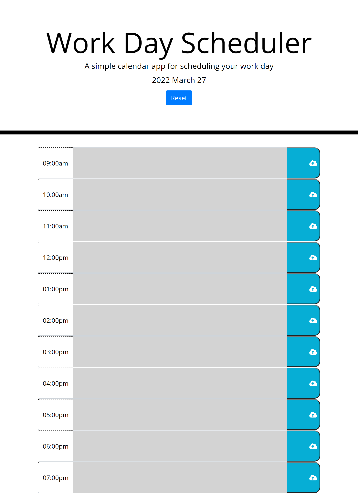

Within this code i am creating a planner for your day. The planner should change colors according to the time of day. If its future present or past it will show a different color. It allows you to save it and it wont be deleted.

ss: 

Link to deployed application: https://yilmazv.github.io/DayPlanner/
